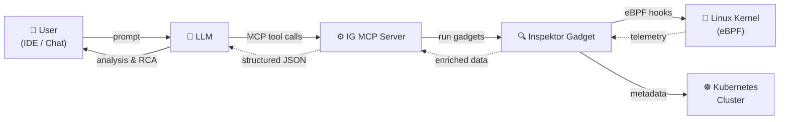
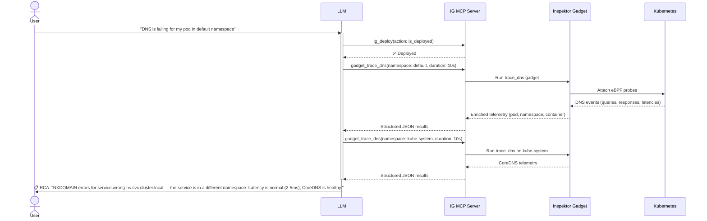
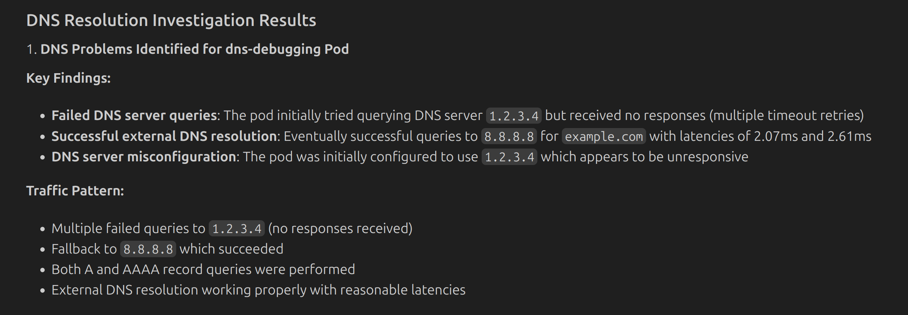
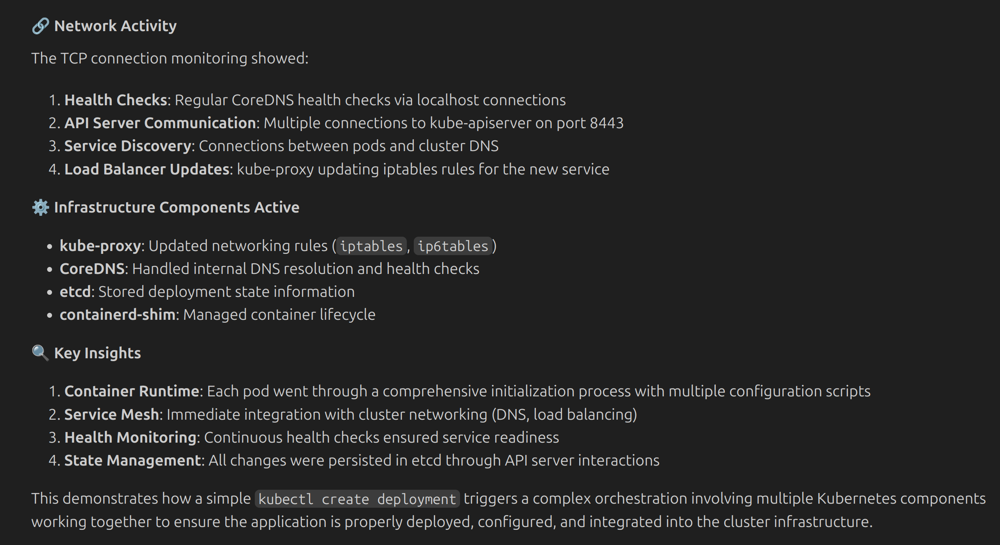
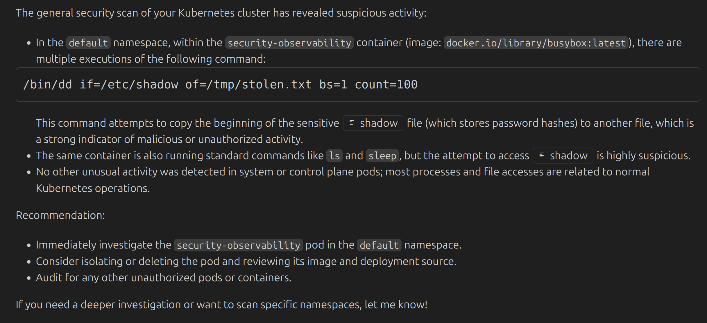
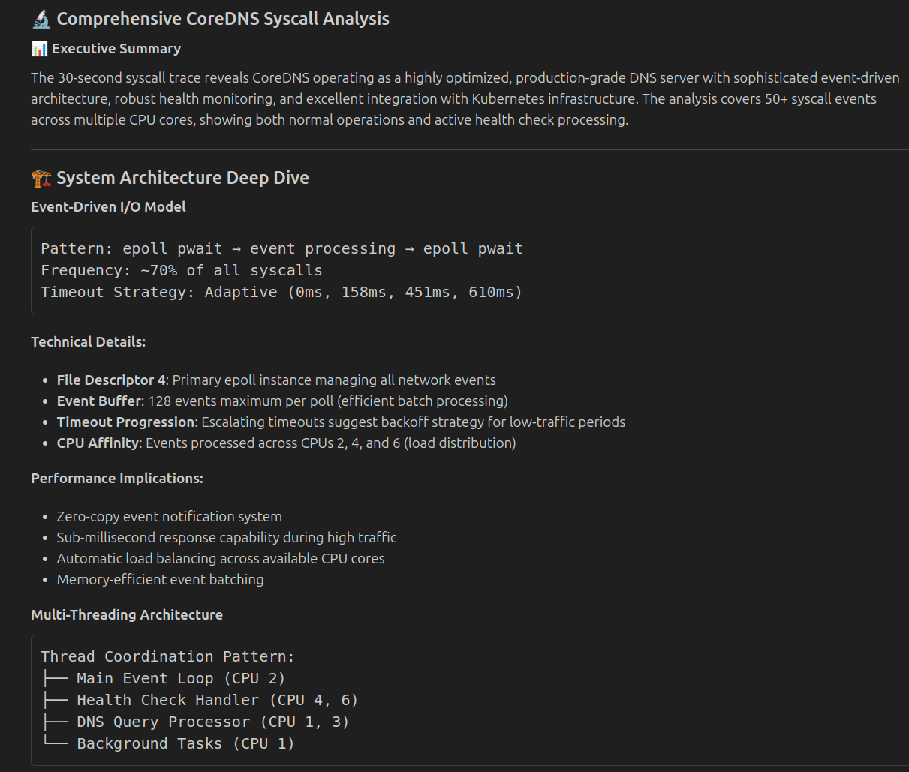

# Inspektor Gadget MCP Server

The Inspektor Gadget MCP Server bridges [Inspektor Gadget](https://github.com/inspektor-gadget/inspektor-gadget)'s low-level kernel observability with LLMs through the [Model Context Protocol (MCP)](https://modelcontextprotocol.io/). It turns raw eBPF-powered telemetry—DNS traces, TCP connections, process executions, file activity, syscalls, and more—into actionable intelligence that AI agents can reason over, enabling **data-driven root cause analysis** directly from your IDE or AI chat interface.

```mermaid
flowchart LR
    User["👤 User<br/>(IDE / Chat)"]
    LLM["🤖 LLM"]
    MCP["⚙️ IG MCP Server"]
    IG["🔍 Inspektor Gadget"]
    Kernel["🐧 Linux Kernel<br/>(eBPF)"]
    K8s["☸️ Kubernetes<br/>Cluster"]

    User -- prompt --> LLM
    LLM -- MCP tool calls --> MCP
    MCP -- run gadgets --> IG
    IG -- eBPF hooks --> Kernel
    Kernel -. telemetry .-> IG
    IG -. enriched data .-> MCP
    MCP -. structured JSON .-> LLM
    LLM -- analysis & RCA --> User
    IG -- metadata --> K8s
```

## Features

- **AI-powered root cause analysis** — LLMs correlate low-level kernel data across multiple gadgets to pinpoint issues with confidence, replacing guesswork with evidence.
- **Full gadget lifecycle management** — Deploy, run, stop, and retrieve results from Inspektor Gadget tools without ever leaving your AI chat.
- **Foreground & background modes** — Run gadgets in foreground for quick debugging or in background for continuous observability, then retrieve results when ready.
- **Dynamic tool registration** — Each gadget becomes its own MCP tool (e.g., `gadget_trace_dns`, `gadget_trace_tcp`), with parameters, field descriptions, and filtering automatically generated from gadget metadata.
- **Read-only mode** — Restrict the server to non-destructive operations for safe production use.
- **Flexible deployment** — Run as a local binary (stdio), Docker container, or deploy directly into your Kubernetes cluster (HTTP transport).

## Background

### The observability gap

Kubernetes troubleshooting is hard. Traditional tools give you logs, metrics, and high-level resource states—but when things go wrong at the network, syscall, or kernel level, there's a gap between _what you can see_ and _what's actually happening_.

[Inspektor Gadget](https://github.com/inspektor-gadget/inspektor-gadget) fills this gap. It provides modular observability units called **gadgets**—eBPF programs that hook into the Linux kernel to collect low-level telemetry data in real time. Gadgets can trace DNS queries, TCP connections, process executions, file opens, signals, OOM kills, syscalls, and much more, all enriched with Kubernetes metadata (pod, namespace, container, node).

### Why LLMs change the game

This kernel-level data is a superpower, but it's also _dense_. A single 10-second DNS trace can produce hundreds of events across dozens of pods. Manually sifting through raw telemetry to correlate events, spot anomalies, and identify root causes requires deep expertise and significant time.

LLMs are the missing piece. By exposing Inspektor Gadget through MCP, AI agents can:

1. **Autonomously select the right gadgets** — Given a problem description, the LLM decides which telemetry to collect (DNS traces? TCP connections? Process executions?) without you needing to know which gadget to run.
2. **Correlate across data sources** — The AI can run multiple gadgets, cross-reference their outputs, and build a complete picture of what happened.
3. **Perform confident, data-driven RCA** — Instead of speculating, the LLM grounds its analysis in real kernel-level evidence, identifying the exact DNS lookup that failed, the precise TCP connection that was refused, or the specific process that triggered an OOM kill.
4. **Explain findings in plain language** — Raw eBPF output becomes a clear, actionable summary with concrete next steps.

```mermaid
sequenceDiagram
    actor User
    participant LLM
    participant MCP as IG MCP Server
    participant IG as Inspektor Gadget
    participant K8s as Kubernetes

    User->>LLM: "DNS is failing for my pod in default namespace"
    activate LLM
    LLM->>MCP: ig_deploy(action: is_deployed)
    MCP-->>LLM: ✅ Deployed
    LLM->>MCP: gadget_trace_dns(namespace: default, duration: 10s)
    MCP->>IG: Run trace_dns gadget
    IG->>K8s: Attach eBPF probes
    K8s-->>IG: DNS events (queries, responses, latencies)
    IG-->>MCP: Enriched telemetry (pod, namespace, container)
    MCP-->>LLM: Structured JSON results
    LLM->>MCP: gadget_trace_dns(namespace: kube-system, duration: 10s)
    MCP->>IG: Run trace_dns on kube-system
    IG-->>MCP: CoreDNS telemetry
    MCP-->>LLM: Structured JSON results
    deactivate LLM
    LLM->>User: 📋 RCA: "NXDOMAIN errors for service.wrong-ns.svc.cluster.local — the service is in a different namespace. Latency is normal (2-5ms), CoreDNS is healthy."
```

### See it in action

The AI selects relevant gadgets, collects data, and analyzes results—all in a single conversational flow:

https://github.com/user-attachments/assets/0f146943-3bf9-4c4d-90c8-76a101d7a4b4

> The LLM autonomously runs `gadget_tcpdump` and `gadget_snapshot_socket` to capture TCP connection RESET events, then analyzes the enriched telemetry to identify the exact connection that was refused, correlating it with the pod and container metadata to provide a precise root cause analysis.

## Quick Start

1. Ensure you have Docker and a valid `kubeconfig` file
2. Configure the MCP server in your IDE or CLI — see [INSTALL.md](INSTALL.md) for setup guides covering **VS Code**, **GitHub Copilot CLI**, **Claude Code**, and other MCP-compatible clients
3. Start chatting: _"Show me DNS traffic"_, _"Are there any failed TCP connections?"_, or _"Deploy Inspektor Gadget"_
4. Explore the [examples](examples/README.md) for detailed walkthroughs

## Installation

The IG MCP Server can be installed via **Docker**, **binary**, or deployed **directly into your Kubernetes cluster**. See the [Installation Guide](INSTALL.md) for full instructions, client setup (VS Code, Copilot CLI, Claude Code), and all configuration options.

## Available Tools

### Inspektor Gadget Lifecycle

| Tool | Description |
|------|-------------|
| `ig_deploy` | Deploy, upgrade, undeploy, or check the status of Inspektor Gadget on your cluster |

### Gadget Management

| Tool | Description |
|------|-------------|
| `ig_gadgets` | List running gadgets, retrieve results from background runs, or stop gadgets |

### Gadget Tools (Dynamically Registered)

Each gadget is registered as its own MCP tool, prefixed with `gadget_`, with full parameter support. The available gadgets depend on your configuration:

| Category | Example Tools | What they do |
|----------|---------------|--------------|
| **Tracing** | `gadget_trace_dns`, `gadget_trace_tcp`, `gadget_trace_exec`, `gadget_trace_open`, `gadget_trace_signal`, `gadget_trace_bind` | Capture real-time events (DNS queries, TCP connections, process executions, file opens, signals, socket bindings) |
| **Snapshots** | `gadget_snapshot_process`, `gadget_snapshot_socket` | Point-in-time snapshots of running processes or open sockets |
| **Top** | `gadget_top_file`, `gadget_top_tcp`, `gadget_top_blockio` | Periodically report top resource consumers (file I/O, TCP traffic, block I/O) |
| **Profiling** | `gadget_profile_blockio`, `gadget_profile_tcprtt` | Profile block I/O latency or TCP round-trip times |
| **Security** | `gadget_trace_capabilities`, `gadget_advise_seccomp`, `gadget_audit_seccomp`, `gadget_trace_lsm` | Trace capability checks, suggest/audit seccomp profiles, trace LSM hooks |
| **Advanced** | `gadget_traceloop`, `gadget_trace_oomkill`, `gadget_trace_ssl`, `gadget_deadlock` | Syscall flight recorder, OOM kill tracing, SSL/TLS capture, deadlock detection |

Each tool supports **foreground** (default) and **background** run modes, field-level output filtering, and produces structured JSON output that the LLM automatically summarizes.

> **⚠️ Context window note:** Every registered MCP tool consumes part of the LLM's context window — its tool definition, parameter schema, and field descriptions all count toward the limit. If you're working with a model that has a smaller context window, or you want to maximize the space available for gadget output and analysis, use `-gadget-images` to load only the gadgets you need instead of discovering all available gadgets via Artifact Hub. For example, `-gadget-images=trace_dns:latest,trace_tcp:latest` registers just two tools instead of 30+.

#### Gadget Discovery

Control which gadgets are available:

- **Automatic**: Discover from Artifact Hub (`-gadget-discoverer=artifacthub`)
- **Manual**: Specify exact gadgets (`-gadget-images=trace_dns:latest,trace_tcp:latest`)

See [INSTALL.md](INSTALL.md) for all configuration options.

## Examples

| Example | Description | Screenshot |
|---------|-------------|------------|
| [DNS Debugging](examples/kubernetes/dns-debugging/README.md) | Troubleshoot DNS resolution issues by tracing queries, detecting failures, and analyzing latency patterns |  |
| [Understanding Kubernetes](examples/kubernetes/understanding-kubernetes/README.md) | Observe real-time cluster activity during deployments using multiple gadgets in background mode |  |
| [Security Observability](examples/kubernetes/security-observability/README.md) | Detect suspicious activities by monitoring process executions and file access patterns |  |
| [Syscall Recording](examples/kubernetes/syscall-recording/README.md) | Record and replay syscall sequences for deep debugging of pod behavior |  |

## Security Notes

- Requires read-only access to your kubeconfig file
- Needs network access for Artifact Hub discovery
- Supports `-read-only` mode to restrict to non-destructive operations
- See [Security Guide](SECURITY.md) for setting up the server with minimal permissions

## Resources

- 📖 [Documentation](https://inspektor-gadget.io/docs/)
- 🔍 [Examples](examples/README.md)
- 📋 [Installation Guide](INSTALL.md)
- 🐛 [Issues](https://github.com/inspektor-gadget/ig-mcp-server/issues)
- 💬 [Slack](https://kubernetes.slack.com/channels/inspektor-gadget)
- 🌐 [Website](https://inspektor-gadget.io/)
- 📋 [Troubleshooting](TROUBLESHOOTING.md)
- 🔒 [Security Guide](SECURITY.md)
- 🤝 [Contributing](CONTRIBUTING.md)

## Related Projects

- [Inspektor Gadget](https://github.com/inspektor-gadget/inspektor-gadget) — eBPF-based observability tool for Linux and Kubernetes
- [MCP Specification](https://spec.modelcontextprotocol.io/) — Model Context Protocol

## License

Apache License 2.0 — see [LICENSE](LICENSE) for details.
