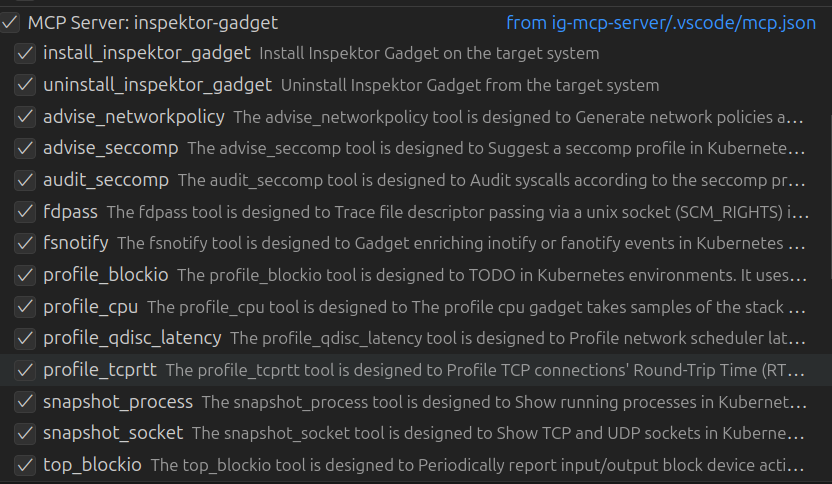

# Inspektor Gadget MCP Server

AI-powered debugging and inspection for Kubernetes clusters using Inspektor Gadget.

https://github.com/user-attachments/assets/86367982-c0aa-455c-ac9e-ca43348899df

## Features

- AI-powered interface for Kubernetes troubleshooting and monitoring
- One-click Inspektor Gadget deployment and removal
- Intelligent output summarization and analysis
- Automatic gadget discovery from Artifact Hub

## Quick Start

1. Ensure you have Docker and a valid `kubeconfig` file
2. Configure the MCP server in VS Code (see [INSTALL.md](INSTALL.md))
3. Start using AI commands in VS Code Copilot Chat
4. Try: "Show me DNS traffic" or "Deploy Inspektor Gadget"
5. Head to [examples](examples/README.md) for detailed examples.

## Installation

You can use the following commands to quickly configure the Inspektor Gadget MCP server using either Docker or a binary in your VS Code settings.

### Docker

  

    
Install Inspektor Gadget MCP Server - Artifact Hub Discovery

    <pre><code>code --add-mcp '{
  "name": "inspektor-gadget",
  "command": "docker",
  "args": [
    "run",
    "-i",
    "--rm",
    "--mount",
    "type=bind,src=${env:HOME}/.kube/config,dst=/kubeconfig",
    "ghcr.io/inspektor-gadget/ig-mcp-server:latest",
    "-gadget-discoverer=artifacthub"
  ]
}'</code></pre>
  

    
Install Inspektor Gadget MCP Server - Specific Gadgets

    <pre><code>code --add-mcp '{
  "name": "inspektor-gadget",
  "command": "docker",
  "args": [
    "run",
    "-i",
    "--rm",
    "--mount",
    "type=bind,src=${env:HOME}/.kube/config,dst=/kubeconfig",
    "ghcr.io/inspektor-gadget/ig-mcp-server:latest",
    "-gadget-images=trace_dns:latest,trace_tcp:latest,snapshot_process:latest,snapshot_socket:latest"
  ]
}'</code></pre>
  

### Binary

You can head to the [Releases](https://github.com/inspektor-gadget/ig-mcp-server/releases) page and download the latest binary for your platform:

  

    
Linux

    <pre><code>MCP_VERSION=$(curl -s https://api.github.com/repos/inspektor-gadget/ig-mcp-server/releases/latest | jq -r .tag_name)
MCP_ARCH=amd64
curl -sL https://github.com/inspektor-gadget/ig-mcp-server/releases/download/${MCP_VERSION}/ig-mcp-server-linux-${MCP_ARCH}-${MCP_VERSION}.tar.gz | sudo tar -C /usr/local/bin -xzf - ig-mcp-server
</code></pre>
  

After downloading, you can run the following command to add it to your VS Code MCP configuration.

  

    
Install Inspektor Gadget MCP Server - Artifact Hub Discovery

    <pre><code>code --add-mcp '{
  "name": "inspektor-gadget",
  "command": "ig-mcp-server",
  "args": [
    "-gadget-discoverer=artifacthub"
  ]
}'</code></pre>
  

    
Install Inspektor Gadget MCP Server - Specific Gadgets

    <pre><code>code --add-mcp '{
    "name": "inspektor-gadget",
    "command": "ig-mcp-server",
    "args": [
      "-gadget-images=trace_dns:latest,trace_tcp:latest"
    ]
}'</code></pre>
    

## Available Tools

### Management Tools
- **is_inspektor_gadget_deployed**: Checks if Inspektor Gadget is deployed in your cluster
- **deploy_inspektor_gadget**: Installs Inspektor Gadget in your cluster
- **undeploy_inspektor_gadget**: Removes Inspektor Gadget from your cluster

### Lifecycle Tools

- **gadgets**: Each gadget has its own MCP tool (e.g., `trace_dns`, `trace_tcp`, etc.). It currently supports running gadgets in foreground mode, which is useful for debugging/development and also in background mode for observability.
- **stop-gadget**: Stops a background running gadget
- **get-results**: Retrieves results from a background running gadget

#### Gadget Discovery

Gadget discovery allows controlling which gadgets are available for use. You can choose between two methods:

- **Automatic**: Uses Artifact Hub (`-gadget-discoverer=artifacthub`)
- **Manual**: Specify gadgets directly (`-gadget-images=trace_dns:latest`)

See [INSTALL.md](INSTALL.md) for configuration options.

## Security Notes

- Requires read-only access to your kubeconfig file
- Needs network access for Artifact Hub discovery
- Ensure appropriate RBAC policies in your cluster

## Resources

- 📖 [Documentation](https://inspektor-gadget.io/docs/)
- 🔍 [Examples](examples/README.md)
- 🐛 [Issues](https://github.com/inspektor-gadget/ig-mcp-server/issues)
- 💬 [Slack](https://kubernetes.slack.com/channels/inspektor-gadget)
- 🌐 [Website](https://inspektor-gadget.io/)
- 📋 [Troubleshooting](TROUBLESHOOTING.md)

## Related Projects

- [Inspektor Gadget](https://github.com/inspektor-gadget/inspektor-gadget) - Kubernetes debugging tool
- [MCP Specification](https://spec.modelcontextprotocol.io/) - Model Context Protocol

## License

Apache License 2.0 - see [LICENSE](LICENSE) for details.
