# DNS Debugging with Inspektor Gadget MCP Server

## Description
This example demonstrates how to use Inspektor Gadget MCP server to debug DNS resolution issues in Kubernetes clusters. Because let's face it, DNS problems are the "it works on my machine" of the networking world.

## Environment
- Kubernetes Cluster: [AKS](https://azure.microsoft.com/en-us/products/kubernetes-service)
- Model: [Claude Sonnet 4](https://www.anthropic.com/claude/sonnet)
- MCP Client: [VS Code](https://code.visualstudio.com/docs/copilot/chat/mcp-servers)
- MCP Server: [Inspektor Gadget MCP Server](https://github.com/inspektor-gadget/ig-mcp-server)
- MCP Tools:
    - Inspektor Gadget MCP server: `is_inspektor_gadget_deployed`, `trace_dns`, `snapshot_process`

### mcp.json

```json
{
  "servers": {
    "inspektor-gadget": {
      "type": "stdio",
      "command": "ig-mcp-server",
      "args": [
        "-gadget-images=snapshot_process,trace_dns",
        "-read-only"
      ]
    }
  }
}
```

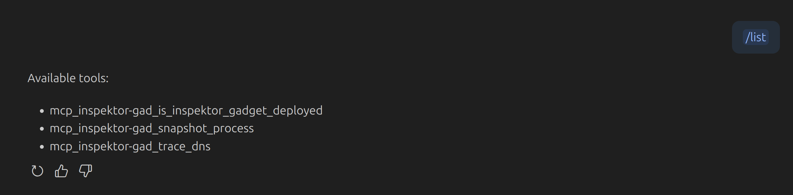

## Protocol

<details>
  <summary>Prompt</summary>
I'm experiencing DNS resolution issues for dns-debugging pod in default namespace. Using Inspektor Gadget, I want to:

Identify the specific DNS problems and trace its DNS traffic to detect failed or delayed lookups.

Investigate whether Kubernetes components like CoreDNS are also affected by tracing DNS traffic in the kube-system namespace.

Analyze the latency of DNS queries and determine if there are any patterns in the DNS traffic that could indicate misconfigurations or network issues.
</details>

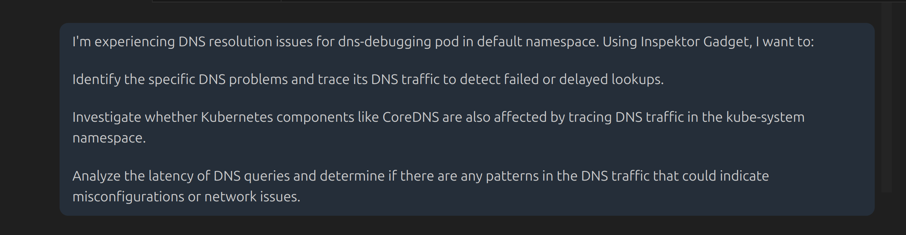

> **💡 Commentary:** We start with a specific prompt including pod name and namespace, which helps the AI focus on the right resources. It's like giving GPS coordinates instead of "turn left at the big tree"—much more helpful for everyone involved.

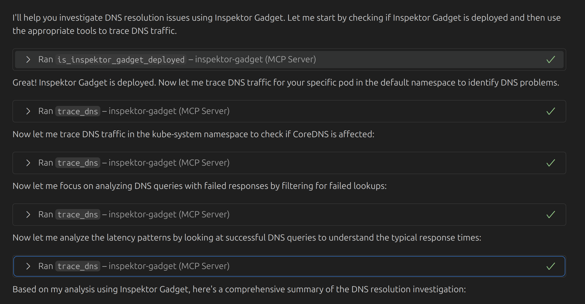

> **💡 Commentary:** The AI starts by checking if Inspektor Gadget is deployed (smart move) and then performs multiple runs of the `trace_dns` gadget, each with different parameters. It's like a methodical detective collecting evidence from different crime scenes—except the crime is DNS misconfiguration.
> Let's walk through each run to understand the AI's strategy.

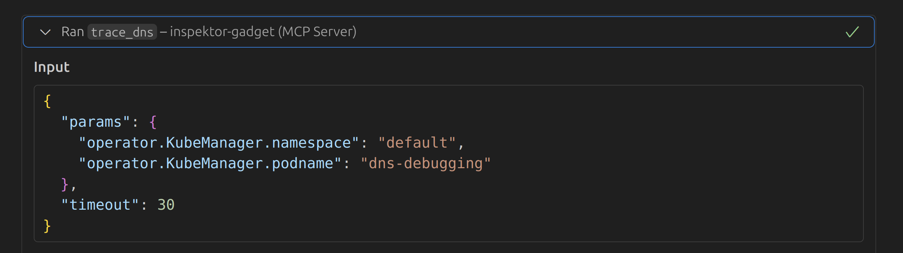

> **💡 Commentary:** First, it focuses on the `default` namespace and our troublesome `dns-debugging` pod. Starting with the obvious suspect—good detective work.

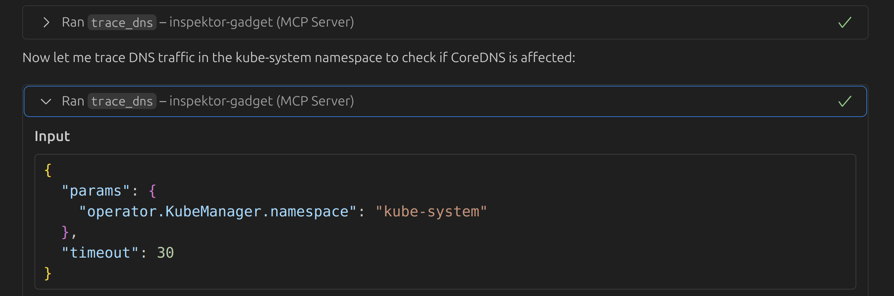

> **💡 Commentary:** Now we're investigating the `kube-system` namespace, where CoreDNS lives. Because if CoreDNS is having a bad day, everyone's having a bad day.

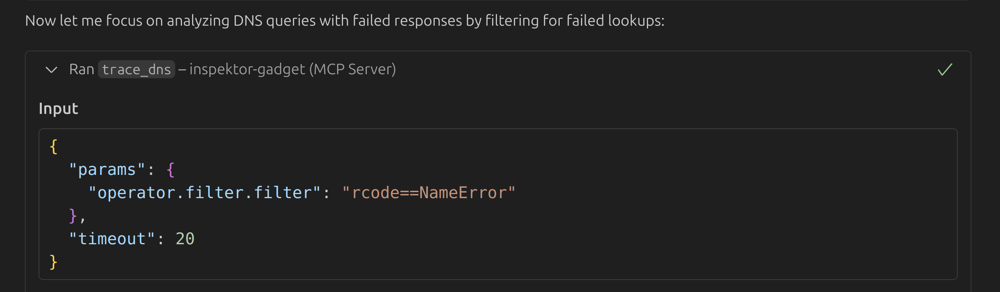

> **💡 Commentary:** This run focuses on DNS queries that returned `NameError` responses. It's basically collecting all the "404 Not Found" equivalent errors in DNS land—very telling indeed.

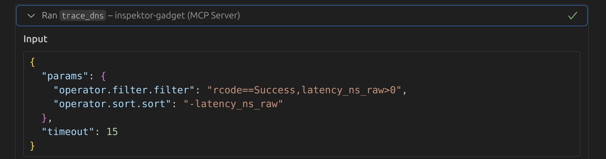

> **💡 Commentary:** Finally, we're looking at DNS queries with latency information. Because sometimes it's not about whether DNS works, but whether it works fast enough before everyone gives up and goes home.

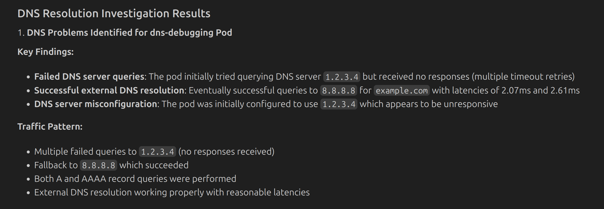

> **💡 Commentary:** Excellent! The AI spotted the rogue nameserver `1.2.3.4`. That's definitely not going to resolve anything useful—unless you're trying to reach the void.

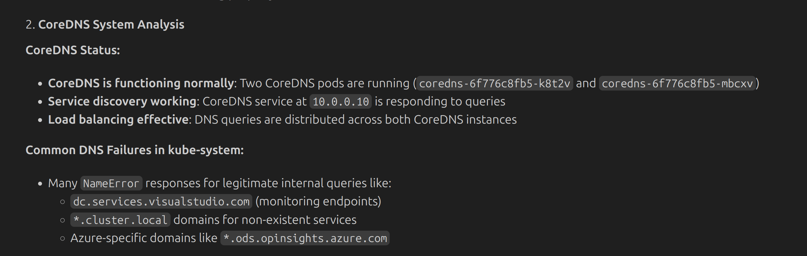

> **💡 Commentary:** The AI also identified DNS queries with `NameError` responses across the entire cluster.

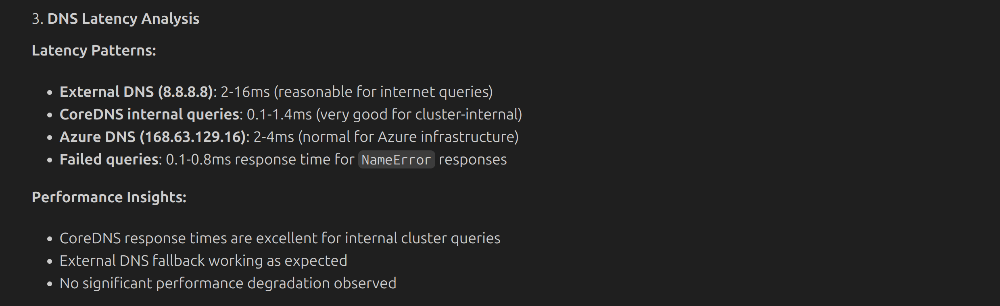

> **💡 Commentary:** Here we get the latency numbers with some analysis of whether they're acceptable or not.

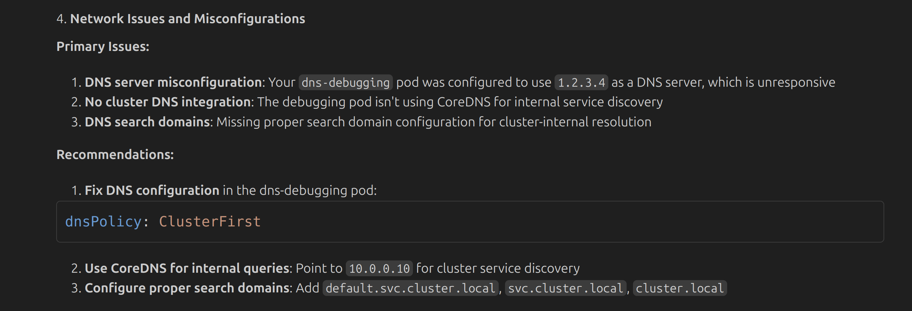

> **💡 Commentary:** Finally, the AI provides actionable recommendations to fix the issues. It's refreshing when debugging actually leads to solutions instead of more questions.

## Conclusion

This example demonstrates how to use the Inspektor Gadget MCP server for DNS debugging in Kubernetes clusters. By tracing DNS queries and responses, you can quickly identify resolution issues, network problems, and configuration errors that affect service discovery.

This approach is particularly valuable for troubleshooting intermittent DNS issues (the worst kind), validating CoreDNS, and ensuring proper service discovery in your cluster! 
