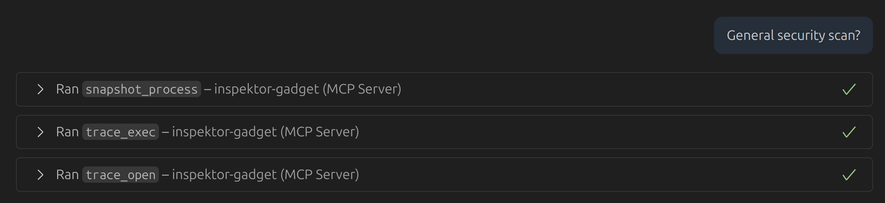

# Security Observability with Inspektor Gadget MCP Server

## Description
This example demonstrates how to use Inspektor Gadget MCP server to monitor security-related activities in Kubernetes clusters. The goal is not to have a sophisticated intrusion detection system, but more of conversation without much context to see how the AI can help us set up security observability.
For this example, we will use [security observability pod](security-observability-pod.yaml) that runs few suspicious commands to simulate security threats.

## Environment
- Kubernetes Cluster: [AKS](https://azure.microsoft.com/en-us/products/kubernetes-service)
- Model: [GPT-4.1](https://openai.com/index/gpt-4-1/)
- MCP Client: [VS Code](https://code.visualstudio.com/docs/copilot/chat/mcp-servers)
- MCP Server: [Inspektor Gadget MCP Server](https://github.com/inspektor-gadget/ig-mcp-server)
- MCP Tools:
    - Inspektor Gadget MCP server: `is_inspektor_gadget_deployed`, `trace_exec`, `trace_open`, `snapshot_process`

### mcp.json

```json
{
  "servers": {
    "inspektor-gadget": {
      "type": "stdio",
      "command": "ig-mcp-server",
      "args": [
        "-gadget-images=trace_exec,trace_open,snapshot_process"
      ]
    }
  }
}
```


## Protocol


> **💡 Commentary:** We start with a simple question about suspicious activities in the Kubernetes cluster. Given we only have Inspektor Gadget tools available, the AI will focus on using those tools to gather information—
> but you might want to use more specific questions to get better results depending on your use case. It's like asking "Is there anything weird going on?" and expecting Sherlock Holmes-level deduction.


> **💡 Commentary:** Since deployment of Inspektor Gadget is not a read-only operation, the AI checks with us before proceeding. This is a good practice to avoid unintended changes in the cluster.
> At least it asks for permission before installing its surveillance network—more polite than most software these days.


> **💡 Commentary:** The AI deploys Inspektor Gadget in the cluster. Also, MCP tools for each gadget are automatically registered, allowing us to use them in further interactions.
> Watch as the AI transforms from "I have no tools" to "I am become observer, watcher of pods" in seconds.


> **💡 Commentary:** See how we have more tools available now, including `trace_exec`, `trace_open`, and `snapshot_process`. These tools will help us monitor process executions, file accesses, and system snapshots.
> It's like giving a security guard X-ray vision, super hearing, and the ability to freeze time. What could go wrong?



> **💡 Commentary:** The AI starts with taking a snapshot of the workloads and then looking for open files and process executions. No complaints about the choice of gadgets, as they are suitable for security observability.


> **💡 Commentary:** Interesting, the AI identifies a suspicious workload and comes up with recommendations for next steps. This is a powerful way to get insights into potential security threats in the cluster.
> The AI basically just said "Hey, that looks sketchy" with the confidence of someone who's never been wrong about anything. Spoiler alert: it's probably right.


> **💡 Commentary:** The AI provides details about the suspicious workload, including the command executed and the files accessed. All this information is collected in real-time using the Inspektor Gadget tools.
> At this point, the AI knows more about what's happening in your cluster than you do. Time to update that LinkedIn profile to "Former Kubernetes Admin."

## Conclusion

This example demonstrates how to use Inspektor Gadget MCP server to monitor security-related activities in Kubernetes clusters. This showcases the potential of using AI-driven tools for security observability in Kubernetes environments.

Also, it highlights some of the flows of using Inspektor Gadget MCP server, such as deployment, automatic registration of tools, and the ability to run gadgets across the cluster.
