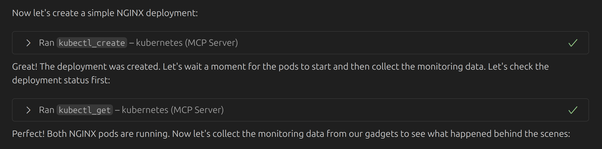

# Understanding Kubernetes with Inspektor Gadget MCP Server

## Description
This example demonstrates how to use Inspektor Gadget MCP server to gain insights into Kubernetes clusters.

## Environment
- Kubernetes Cluster: [minikube](https://github.com/kubernetes/minikube)
- Model: [Claude Sonnet 4](https://www.anthropic.com/claude/sonnet)
- MCP Client: [VS Code](https://code.visualstudio.com/docs/copilot/chat/mcp-servers)
- MCP Server: [Inspektor Gadget MCP Server](https://github.com/inspektor-gadget/ig-mcp-server), [Kubernetes MCP Server](https://github.com/Flux159/mcp-server-kubernetes)
- MCP Tools:
    - Inpektor Gagdet MCP server: `is_inspektor_gadget_deployed`, `get-results`, `stop-gadget`, `trace_tcp`, `trace_dns`, `trace_exec`, `trace_open`
    - Kubernetes MCP server: `kubectl_create`, `kubectl_get`
  


### mcp.json

```json
{
  "servers": {
    "inspektor-gadget": {
      "type": "stdio",
      "command": "ig-mcp-server",
      "args": [
        "-gadget-images=trace_exec,trace_open,trace_tcp,trace_dns,traceloop"
      ]
    },
    "kubernetes": {
      "type": "stdio",
      "command": "npx",
      "args": [
        "mcp-server-kubernetes"
      ]
    }
  }
}
```

## Protocol

#### User:

<details>
  <summary>Prompt</summary>
  Hi, I want to understand what happens behind the scenes in Kubernetes during typical operations. To do this, I’d like to use Inspektor Gadget to observe real-time activity. Here's the idea:

  - Start a few relevant gadgets
  - Create a simple NGINX deployment.  
  - Observe and analyze the output from the gadgets to understand what happens inside the cluster during deployment.

  Please keep the output concise since I want to document this interaction!
</details>


> **💡 Commentary:** Notice how we don’t specify which gadget to use—AI selects the most appropriate one based on the context. While it could have run the gadgets in the foreground (the default behavior), it chose to run them in the background, which better fits our use case.
> Also, see how we specify the need for concise output, which is important for documentation purposes.

#### AI:


> **💡 Commentary:** The AI starts by checking if Inspektor Gadget is deployed in the cluster, which is a good first step to ensure that the necessary tools are available for observation.
> Also, it decided to monitor specific aspects around the workload, which is a good approach to focus on relevant data. It probably should have picked trace_open as well, but hey, it’s AI—not a mind reader.


> **💡 Commentary:** The AI successfully started the gadgets, see how it keeps gadget instance ids in the context, which is useful for later reference.



> **💡 Commentary:** The AI creates a simple NGINX deployment, which is a common workload in Kubernetes. This step is crucial for generating activity that can be observed by the gadgets.


> **💡 Commentary:** The AI retrieves the results from the gadgets (using the gadget instance IDs), which is where the real insights come from.


> **💡 Commentary:** Finally, the AI stops the gadgets, which is a good practice to clean up resources after the observation is complete. Isn’t it amazing how it all just magically works?


> **💡 Commentary:** The NGINX deployment starts up, and the AI can observe the activity generated by the gadgets. See how Inspektor Gadget is able to capture the very first activity of the workload, which is crucial for understanding the startup process.


> **💡 Commentary:** The AI analyzes the data and provides additional insights—useful, maybe, but I probably should’ve been clearer about what I actually wanted to see. Next time I’ll try speaking AI-ese.

### User


> **💡 Commentary:** You can always ask the AI for more details or follow-up questions to dive deeper into specific aspects of the Kubernetes activity. It even configures filters to keep the output concise and relevant to your question.
Honestly, it’s starting to feel like it knows Kubernetes better than I do.

## Conclusion

This example demonstrates how to use the Inspektor Gadget MCP server to gain insights into Kubernetes clusters by observing real-time activity. The AI leveraged available gadgets to monitor the deployment of a simple NGINX workload, offering valuable visibility into Kubernetes operations.

This interaction highlights how AI can simplify the understanding of complex systems like Kubernetes. You can easily extend this approach to monitor more advanced workloads or specific scenarios in your own cluster. Give it a try and share your feedback!